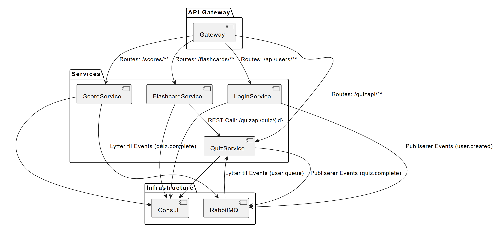

# LearningApp: Microservices-Based Quiz Application

## Github link: [https://github.com/AnnaRandeberg/PG3402](https://github.com/AnnaRandeberg/PG3402)

## Introduction

The goal of this project is to create a user-friendly learning app designed for middle school students. We've all experienced how reading school textbooks can sometimes feel boring, and it can be difficult to keep track of multiple subjects and curriculum demands. As the curriculum grows more challenging, our aim is to make learning easier and more enjoyable for the next generation.

Our solution is to turn learning into a fun, game-like experience. The app will feature quizzes subjects, with users receiving scores for each quiz. A leaderboard will allow students to compete with classmates, adding a layer of friendly competition that can be a strong motivator. Additionally, users will have access to making flashcards. 

This project leverages microservice architecture to provide scalability, maintainability and flexibility for future enhancements. Key components include services for managing quizzes, scores, user authentication and flashcards, with RabbitMQ handling asynchronous communication and Consul ensuring service discovery.

## **How to Run the Project**

### **1. Build the Project**
To build the project, navigate to each service directory (`pg3402/loginservice`, `pg3402/flashcardservice`, `pg3402/quizservice`, `pg3402/scoreservice`, `pg3402/gateway`) and run the following command in the terminal:

```bash
mvn clean install
```

### **2. Start the Project**
Once all services are built, navigate to the `pg3402/docker` folder and run the following commands:

```bash
docker-compose down
docker-compose up --build -d
```

This will start all services as Docker containers.

### **3. Monitor Services**
- Open Consul to check the status of all services:  
  [http://localhost:8500/ui/dc1/services](http://localhost:8500/ui/dc1/services)  
  Wait until all services are displayed as green in Consul:
  - `gateway`
  - `loginservice`
  - `flashcardservice`
  - `scoreservice`
  - `quizservice`
  - `consul`

### **4. H2 Database Console**
Each service has an H2 database accessible through the following links:

| Service           | URL                                           | JDBC URL                | Username | Password |
|--------------------|-----------------------------------------------|-------------------------|----------|----------|
| Login Service      | [http://localhost:8084/h2-console](http://localhost:8084/h2-console) | `jdbc:h2:file:~/learningapp` | `user`   | *(none)* |
| Quiz Service       | [http://localhost:8081/h2-console](http://localhost:8081/h2-console) | `jdbc:h2:file:~/learningapp` | `user`   | *(none)* |
| Flashcard Service  | [http://localhost:8087/h2-console](http://localhost:8087/h2-console) | `jdbc:h2:file:~/learningapp` | `user`   | *(none)* |
| Score Service      | [http://localhost:8082/h2-console](http://localhost:8082/h2-console) | `jdbc:h2:file:~/learningapp` | `user`   | *(none)* |

### **5. RabbitMQ**
RabbitMQ is used for asynchronous communication between services.  
Access the RabbitMQ Dashboard at:  
[http://localhost:15672/](http://localhost:15672/)  
Username: `guest`  
Password: `guest`

---

## **Architecture**
The system consists of the following microservices:  
1. **Login Service** (Port: 8084)  
2. **Quiz Service** (Port: 8081)  
3. **Flashcard Service** (Port: 8087)  
4. **Score Service** (Port: 8082)  
5. **Gateway** (Port: 8080)  

Communication types:  
- Synchronous communication: REST calls via Gateway.  
- Asynchronous communication: RabbitMQ for message passing.  

  

---

## **User Stories and API Endpoints**
Below is a list of user stories that allow an examiner to assess the functionality developed in the project. These user stories represent key scenarios that demonstrate the features implemented in the application. Can be used on postman.

---

### **1. User Story: Login/Register**
**As a middle school student,**  
**I want to register/login,**  
**So I can take quizzes and access the learning app.**
- **Register**  
  Method: `POST`  
  URL: `http://localhost:8084/api/users/register`  
  Body:  
  ```json
  {
      "email": "kally@gmail.com",
      "rawPassword": "secret123",
      "firstName": "Kally",
      "lastName": "Kai"
  }
  ```

- **Login**  
  Method: `POST`  
  URL: `http://localhost:8084/api/users/login`  
  Body:  
  ```json
  {
      "email": "kally@gmail.com",
      "rawPassword": "secret123"
  }
  ```
  
**Description:** Users can register and log in using a secure process. Passwords are hashed to ensure data security and prevent plaintext storage in the database.

---

### **2. Connect with Friends**
**As a user of the learning app,**  
**I want to link with friends,**  
**So I can see their quiz scores, compare progress, and motivate each other to improve.**

- **View All Users**  
  Method: `GET`  
  URL: `http://localhost:8084/api/users`

- **Search for a Specific User**  
  Method: `GET`  
  URL: `http://localhost:8084/api/users/search/kally/kai`

**Description:** Users can view all registered users or search for specific friends using their first and last name. Sensitive information remains protected, as only non-critical data is displayed.

---

### **3. Take Quiz**
**As a middle school student,**  
**I want to take quizzes for various subjects and topics,**  
**So that I can learn different subjects in a more engaging way and track my progress.**

- **View All Available Quizzes**  
  Method: `GET`  
  URL: `http://localhost:8081/quizapi`

- **Start a Quiz**  
  Method: `POST`  
  URL: `http://localhost:8081/quizapi/1/start`  
  Body:  
  ```json
  {
      "email": "kally@gmail.com"
  }
  ```

- **Submit Answer**  
  Method: `POST`  
  URL: `http://localhost:8081/quizapi/1/answer`  
  Body:  
  ```json
  {
      "email": "kally@gmail.com",
      "questionId": "1",
      "answer": "4"
  }
  ```

**Description:** Students can view available quizzes, search for quizzes by ID, and submit answers. The system provides immediate feedback.

---

### **4. Admin - Create Quiz**
**As an admin,**  
**I want to create quizzes,**  
**So that students can take them and test their knowledge.**

- **Create Quiz**  
  Method: `POST`  
  URL: `http://localhost:8081/quizapi`  
  Body:  
  ```json
  {
    "email": "admin@gmail.com",
    "title": "Science Grade 9",
    "chapter": "Fungi and Leaves",
    "subject": "Science",
    "questions": [
      {
        "questionId": 1,
        "questionText": "What is a fungus?",
        "correctAnswer": "A type of fungal structure"
      }
    ]
  }
  ```

- **Find Quiz by ID**  
  Method: `GET`  
  URL: `http://localhost:8081/quizapi/quiz/1`

**Description:** Only users with the admin email (`admin@gmail.com`) can create new quizzes. Unauthorized users are denied access.

---

### **5. View Scores**
**As a student,**  
**I want to see my quiz scores,**  
**So I can understand my performance and track my progress.**

- **View Scores for All Users**  
  Method: `GET`  
  URL: `http://localhost:8082/scores`

- **View Score for a Specific User**  
  Method: `POST`  
  URL: `http://localhost:8082/scores/email`  
  Body:  
  ```json
  {
    "email": "kally@gmail.com"
  }
  ```

  **Description:** Users can view their quiz scores and compare progress with others.

---

### **6. User Story: Flashcards**
**As a user,**  
**I want to practice for my quizzes using flashcards,**  
**So that I can improve my scores.**

- **See Flashcards for a Specific Quiz**  
  Method: `GET`  
  URL: `http://localhost:8087/flashcards/quiz/1`  

  **Description:** By integrating with the QuizService, users can fetch flashcards directly tied to quizzes. This promotes seamless interaction between services and demonstrates RESTful communication.

- **Create a Flashcard**  
  Method: `POST`  
  URL: `http://localhost:8087/flashcards`  
  Body:  
  ```json
  {
    "questionText": "Hva er 5 + 3?",
    "answer": "8"
  }
  ```

  **Description:** This functionality allows users to create their own flashcards, similar to how they would in real life when studying. It supports personalized learning and adds interactivity to the application.

- **Retrieve All Flashcards**  
  Method: `GET`  
  URL: `http://localhost:8087/flashcards`  

  **Description:** Retrieves all existing flashcards created by users.  
  
## **Why Microservices?**
Our project is well-suited for a microservices architecture because it addresses many challenges while making the system scalable and flexible. A monolithic architecture would not be ideal, as our system is divided into multiple services with a clear separation of responsibilities.

- **Scalability:** If the QuizService experiences heavy traffic, it can be scaled independently without affecting other services.
- **Maintainability:** Each service handles a specific functionality, making the code organized and easier to maintain.
- **Resilience:** Errors in one service do not affect the entire application, improving system robustness.
- **Collaboration:** With two developers working on this project, microservices allowed us to work on different services simultaneously without interfering with each other or the overall system.

---

### **Technology Choices**
For the database, we initially used Flyway for database migrations, as we had learned it in our backend programming course. However, we encountered numerous issues due to migration file conflicts. To avoid these conflicts and simplify database management, we switched to Spring Boot's built-in database initialization using `data.sql`. This approach provided better control and reduced complexity in our project.

### **Communication in the System**
1. **Synchronous Communication (REST Calls):**
   - **FlashcardService → QuizService:** FlashcardService retrieves quiz data from QuizService using `RestTemplate` to make direct HTTP calls.
   - **API Gateway → All Services:** The API Gateway forwards incoming REST requests to the appropriate microservices using Spring Cloud Gateway.

2. **Asynchronous Communication (RabbitMQ):**
   - **LoginService → RabbitMQ:** When a new user is created, a `UserCreatedEvent` is published to the `user.queue`.
   - **QuizService → RabbitMQ:** After a quiz is completed, a `QuizCompleteEvent` is published to the `quiz.complete` queue.
   - **ScoreService ← RabbitMQ:** ScoreService listens to the `quiz.complete` queue to update user scores accordingly.

---

### **Division of Work**
- **Candidate 81:** Responsible for FlashcardService and QuizService.
- **Candidate 70:** Responsible for ScoreService and LoginService.
- **Docker and Gateway:** Shared responsibilities.

  Additionally, we used a lot of pair programming to solve problems, ensuring both of us 
  contributed to all services equally. Each of us took responsibility for 50% of the workload, 
  with a strong emphasis on collaboration to ensure that we were both actively involved in all 
  parts of the project.
---

### **References**
- **Data Initialization:** [Spring Boot - data.sql](https://www.baeldung.com/spring-boot-data-sql-and-schema-sql#thedatasqlfile)
- **Microservice Diagram Creation:** [Kroki.io](https://kroki.io/)
- **Project Inspiration:** [Bogdan Marculescu's Microservices Project](https://github.com/bogdanmarculescu/microservices2024)

